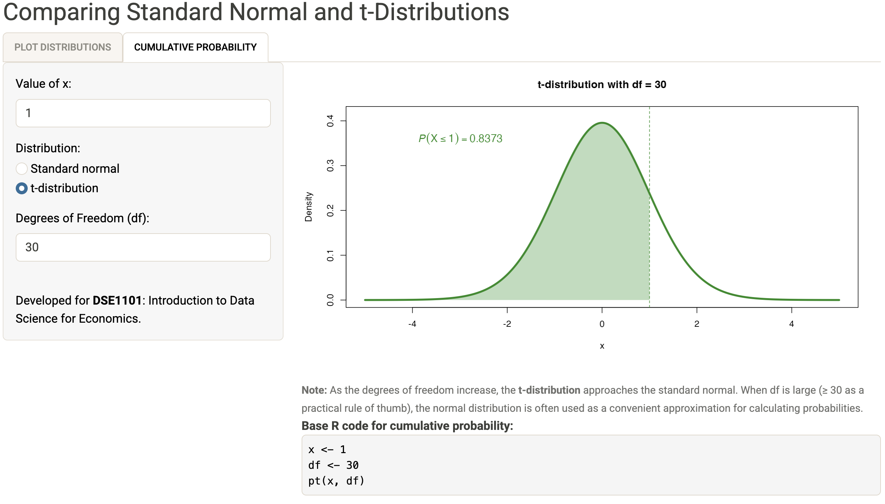

# normal-and-t-app

This is a simple ShinyApp developed for [DSE1101](https://nusmods.com/courses/DSE1101/introductory-data-science-for-economics).

It allows students to:

+ Compare standard normal and t-distributions.

+ Find cumulative probabilities.

+ View the (base) R code for cumulative probabilities.

Access the app [here](https://ythuangy-clt-app.share.connect.posit.cloud/).